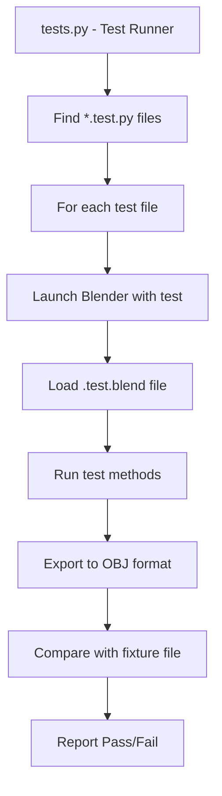

# XPlane2Blender Testing System Explained

## Overview

The XPlane2Blender plugin has a sophisticated automated testing system that ensures the plugin works correctly across different scenarios. Think of it as a quality assurance system that automatically checks if the plugin can export Blender models to X-Plane format correctly.

## Why Testing is Critical for XPlane2Blender

### 1. **Complexity of Export Process**
- The plugin converts complex Blender data (meshes, materials, animations, lights) into X-Plane's OBJ8 format
- Small bugs can result in aircraft that don't work in X-Plane or crash the simulator
- Manual testing of every feature combination would take weeks

### 2. **Regression Prevention**
- When adding new X-Plane 12 features, we need to ensure existing functionality still works
- Tests catch when changes break previously working exports
- Critical for maintaining compatibility across Blender and X-Plane versions

### 3. **Format Validation**
- X-Plane's OBJ8 format has strict syntax requirements
- Tests ensure exported files match expected format exactly
- Validates that new features export correct directives (RAIN_scale, THERMAL_texture, etc.)

## How the Testing System Works

### Architecture Overview



### Key Components

#### 1. **Test Runner (`tests.py`)**
- **Purpose**: Orchestrates the entire testing process
- **How it works**:
  ```bash
  python tests.py --filter "monkey"  # Run only monkey tests
  python tests.py --continue        # Keep running after failures
  ```
- **What it does**:
  - Finds all `*.test.py` files in the `tests/` directory
  - Launches Blender for each test with the plugin loaded
  - Captures output and determines if tests passed or failed
  - Provides detailed reporting

#### 2. **Test Cases (`*.test.py` files)**
- **Purpose**: Define specific scenarios to test
- **Example**: `tests/monkey/monkey.test.py`
  ```python
  class MonkeyTest(XPlaneTestCase):
      def test_monkey_export(self):
          # Export the monkey model and compare to expected output
          self.assertLayerExportEqualsFixture(
              0, 'fixtures/test_monkey.obj', self.filterLines
          )
  ```

#### 3. **Blender Test Files (`*.test.blend`)**
- **Purpose**: Pre-configured Blender scenes with test data
- **Contents**:
  - Models with specific XPlane2Blender settings
  - Materials, animations, lights configured for testing
  - Multiple "layers" (collections) for different test scenarios

#### 4. **Fixture Files (`fixtures/*.obj`)**
- **Purpose**: "Golden master" files showing correct export output
- **How they work**: Tests export current data and compare against these known-good files
- **Example**: If a rain system test exports different RAIN_scale values than expected, the test fails

#### 5. **Test Framework (`io_xplane2blender/tests/__init__.py`)**
- **Purpose**: Provides utilities for writing tests
- **Key features**:
  - `XPlaneTestCase`: Base class for all tests
  - `exportExportableRoot()`: Export specific objects/collections
  - `assertFileOutputEqualsFixture()`: Compare exports to expected results

## Types of Tests

### 1. **Export Validation Tests**
```python
def test_basic_export(self):
    # Export a simple cube and verify OBJ format
    out = self.exportExportableRoot("Cube")
    self.assertIn("TRIS", out)  # Should contain triangle data
```

### 2. **Feature-Specific Tests**
```python
def test_rain_system(self):
    # Test X-Plane 12 rain system export
    out = self.exportExportableRoot("Aircraft")
    self.assertIn("RAIN_scale", out)
    self.assertIn("THERMAL_texture", out)
```

### 3. **Regression Tests**
```python
def test_animation_export(self):
    # Ensure animations still export correctly
    self.assertLayerExportEqualsFixture(
        0, 'fixtures/animation_test.obj', filter_animation_lines
    )
```

### 4. **Compatibility Tests**
```python
def test_blender4_materials(self):
    # Test Blender 4+ material node integration
    # Verify Principled BSDF auto-detection works
```

## Running Tests

### Basic Usage
```bash
# Run all tests
python tests.py

# Run specific test
python tests.py --filter "monkey"

# Run tests but continue after failures
python tests.py --continue

# Quiet output (only show pass/fail)
python tests.py --quiet
```

### Advanced Options
```bash
# Use specific Blender version
python tests.py --blender /path/to/blender

# Debug mode with verbose output
python tests.py --force-xplane-debug --force-blender-debug

# Start at specific test (useful for debugging)
python tests.py --start-at "materials"
```

## Test Structure Example

### Directory Layout
```
tests/
├── tests.py                    # Main test runner
├── template.py                 # Template for new tests
├── monkey/
│   ├── monkey.test.py         # Test code
│   ├── monkey.test.blend      # Blender scene
│   └── fixtures/
│       └── test_monkey.obj    # Expected output
├── materials/
│   ├── materials.test.py
│   ├── materials.test.blend
│   └── fixtures/
└── features/
    ├── rain/
    │   ├── rain_system.test.py
    │   ├── rain_system.test.blend
    │   └── fixtures/
    └── landing_gear/
```

### Test Workflow
1. **Setup**: Load Blender scene with test data
2. **Execute**: Export using XPlane2Blender
3. **Validate**: Compare output to expected fixture
4. **Report**: Pass/fail with detailed differences

## Why the Export Test is Disabled

The file `tests/xplane_export.test.disabled.py` suggests there are issues with basic export functionality:

```python
# This test is disabled because:
def test_export_layers_from_fresh_blend_file(self):
    bpy.ops.export.xplane_obj(filepath=tmpFile)
    self.assertTrue(os.path.exists(tmpFile))  # This might be failing
```

**Possible reasons**:
1. **Export operator broken**: The `bpy.ops.export.xplane_obj()` might not work in Blender 4+
2. **File path issues**: Export might not create files in expected locations
3. **Plugin loading problems**: XPlane2Blender might not load correctly in test environment
4. **API changes**: Blender 4+ might have changed APIs the export system depends on

## Importance for X-Plane 12+ Modernization

### 1. **Validation of New Features**
- Rain system: Tests ensure `RAIN_scale`, `RAIN_friction` export correctly
- Thermal system: Validates `THERMAL_texture`, `THERMAL_source` directives
- Landing gear: Confirms `ATTR_landing_gear` works with all gear types

### 2. **Blender 4+ Compatibility**
- Material system: Tests verify Principled BSDF auto-detection
- UI compatibility: Ensures panels work in Blender 4+
- API usage: Catches deprecated API calls

### 3. **Quality Assurance**
- **Before release**: All tests must pass
- **During development**: Tests catch regressions immediately
- **User confidence**: Comprehensive testing means fewer bugs in production

## Current Testing Status

### ✅ **Working Tests**
- Animation system tests
- Material validation tests
- Light export tests
- Manipulator tests

### ⚠️ **Issues Found**
- **Critical**: Basic export test disabled
- **Missing**: X-Plane 12 specific feature tests
- **Incomplete**: Blender 4+ compatibility tests

### 🎯 **Priority Actions**
1. **Fix disabled export test** - This is blocking basic functionality validation
2. **Add X-Plane 12 feature tests** - Rain, thermal, wiper systems need validation
3. **Create Blender 4+ compatibility tests** - Ensure material integration works
4. **Restore full test suite** - Get comprehensive testing working again

## Benefits of a Working Test Suite

### For Developers
- **Confidence**: Know changes don't break existing functionality
- **Speed**: Automated testing is faster than manual validation
- **Coverage**: Tests scenarios that might be missed manually

### For Users
- **Reliability**: Fewer bugs in released versions
- **Compatibility**: Assurance that plugin works with their Blender/X-Plane versions
- **Features**: New X-Plane 12 features work as expected

### For the Project
- **Maintainability**: Easier to add new features without breaking old ones
- **Documentation**: Tests serve as examples of how features should work
- **Quality**: Professional-grade quality assurance

## Conclusion

The testing system is the **quality backbone** of XPlane2Blender. It ensures that when you export an aircraft from Blender, it will work correctly in X-Plane. The disabled export test is a critical issue because it means we can't automatically verify that the most basic functionality works.

**Think of it this way**: If you were building aircraft for real pilots, you'd want extensive testing to ensure safety. The XPlane2Blender testing system serves the same purpose for virtual aircraft - ensuring they work correctly and don't cause problems in X-Plane.

The modernization effort needs a working test suite to validate that X-Plane 12+ features work correctly and that Blender 4+ compatibility is solid.